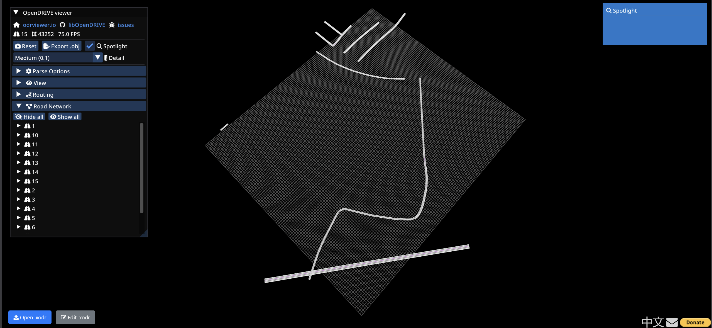

# AVES Reality – Customer Success Case Study: OpenDRIVE Import Fix

## 📝 Scenario Overview
A B2B customer encountered a critical "Segmentation Fault" crash in the AVES Launcher while importing an OpenDRIVE (.xodr) file. This repository contains the diagnostic tools and the automated patcher used to unblock the customer for their demo.

---

## 🛠 1. Problem Summary

**Symptom:**  
Launcher crash (Segmentation Fault) during RoadMeshBuilder execution.

**Root Cause:**  
The logs identified a `[WARN] Road id missing value`. The OpenDRIVE standard requires a unique ID for every road. The C++ builder likely attempted to access a null pointer or empty string, causing the crash.

**Impact:**  
Critical blocker for the scheduled customer demo.

---

## ⚙️ 2. Environment Setup

This project uses zero external dependencies for the core logic to ensure maximum compatibility. You only need a standard Python environment with Jupyter installed.

### Option A: Using Conda (Recommended)

```bash
# 1. Create a new environment with Python 3.9
conda create -n aves-study python=3.9 -y

# 2. Activate the environment
conda activate aves-study

# 3. Install Jupyter using the environment.yml or directly
conda env update --file environment.yml
# OR manually: conda install jupyter -y
````

### Option B: Using Pip

```bash
# 1. Create a virtual environment
python -m venv aves_env

# 2. Activate the environment
# On Windows:
aves_env\Scripts\activate
# On macOS/Linux:
source aves_env/bin/activate

# 3. Install the requirements
pip install -r requirements.txt
```

### Requirements

* Python 3.7+
* `xml.etree.ElementTree` (Included in Python Standard Library)
* `os` (Included in Python Standard Library)

---

🚀 3. How to Run
1. Activate the Environment
Before running the notebook, ensure your environment is active so that Jupyter can access the necessary components.

If using Conda:

```bash
conda activate aves-study
If using Pip (Virtual Env):

# Windows
aves_env\Scripts\activate

# macOS/Linux
source aves_env/bin/activate
```
2. Prepare the Data
Place the original road.xodr file provided by the customer in the data/ directory (or the root directory, depending on your folder structure).

3. Launch Jupyter
Run the following command in your terminal to start the notebook server:

```bash
jupyter notebook
```
4. Execute the Fix
In the browser window that opens, select AVES_Solution_Notebook.ipynb.

Run all cells by selecting Cell > Run All from the top menu.

5. Verify & Deliver
Internal Check: A text-based report will appear in the notebook showing which specific Road IDs were patched.

Geometry Check: Use odrviewer.io to upload the generated road_patched.xodr and verify that the road network renders correctly.

Deployment: Provide the road_patched.xodr to the customer for their demo.

---

## 🔍 4. Support Strategy

### Debugging Approach

* **Log Tracing:** Correlated the Segmentation Fault with the "Road id missing" warning
* **Schema Validation:** Scanned the XML structure to find empty attributes in the `<road>` elements
* **Quick Fix:** Developed a non-destructive script to inject IDs without altering the road geometry

### Visual Verification
After applying the patch, the road network can be successfully visualized and inspected:


### Customer Communication

* **Immediate Value:**
  "We have identified a schema inconsistency in the file and have provided a patched version below to ensure your demo runs smoothly."

* **Proactive Discovery:**
  "To help our engineering team, could you let us know which tool generated this file? We want to ensure our next update handles this specific output automatically."

### Long-Term Fix (Engineering)

* **Graceful Failure:**
  Update `RoadMeshBuilder.cpp` to validate IDs before processing, throwing a caught exception instead of a segfault

* **Pre-import Validation:**
  Add a lightweight "Sanity Check" step in the AVES Launcher UI to warn users of missing mandatory OpenDRIVE attributes

---

## 👤 Author

**Name:** Diego Alarcón
